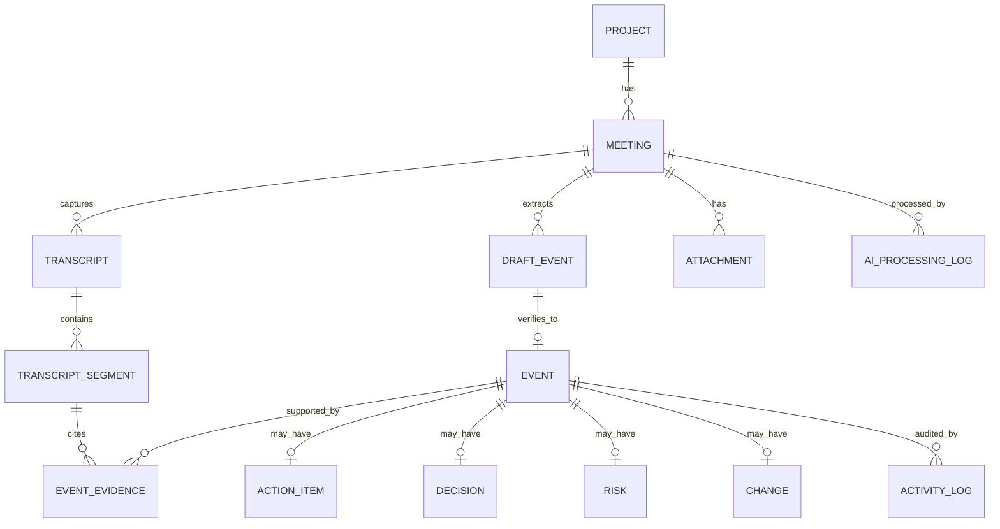

# 03 ERD

```mermaid
erDiagram
  PROJECT ||--o{ MEETING : has
  MEETING ||--o{ TRANSCRIPT : captures
  TRANSCRIPT ||--o{ TRANSCRIPT_SEGMENT : contains
  MEETING ||--o{ DRAFT_EVENT : extracts
  DRAFT_EVENT ||--o| EVENT : verifies_to
  EVENT ||--o{ EVENT_EVIDENCE : supported_by
  TRANSCRIPT_SEGMENT ||--o{ EVENT_EVIDENCE : cites
  EVENT ||--o| ACTION_ITEM : may_have
  EVENT ||--o| DECISION : may_have
  EVENT ||--o| RISK : may_have
  EVENT ||--o| CHANGE : may_have
  MEETING ||--o{ ATTACHMENT : has
  EVENT ||--o{ ACTIVITY_LOG : audited_by
  MEETING ||--o{ AI_PROCESSING_LOG : processed_by
```

Key design: Segment→DraftEvent is 1:N; Event↔Segment is N:M through EVENT_EVIDENCE.
